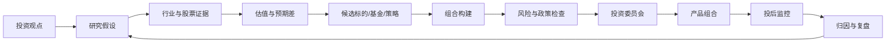

# 私募投资研究与决策系统规划

> 文档状态：战略规划 v1
>
> 适用对象：私募基金管理人内部投研、投资经理、投决会、风险管理和产品管理团队
>
> 核心结论：本项目不应继续建设成面向所有人的通用“基金推荐系统”，而应升级为“私募投资研究、组合构建、投决留痕与投后监控系统”。基金选择只是其中一个场景。

---

## 1. 为什么要重新定义产品方向

当前项目已经具备一套较完整的基金研究底座：

```text
数据门禁
→ 指标计算
→ 标签和分类
→ 证据落库
→ 基准质量检查
→ 持仓穿透
→ 认知选基
→ 组合草案
→ 监控雏形
```

现有项目文档把使用者主要定义为 FOF 基金经理、银行/券商研究团队、第三方基金评价平台和财富管理平台，产品目标偏向产品池准入、基金标签和证据展示。这一定位适合“从市场上筛选外部基金”的场景，但不完全等同于私募基金管理人的核心业务。

私募基金管理人真正需要解决的问题通常不是：

```text
市场上哪只基金排名最高？
```

而是：

```text
我们相信什么？
这个观点对应哪些行业、公司和股票？
当前估值是否合理？
应该进入哪一个策略或产品？
应该承担多大风险和仓位？
投决会为什么通过或否决？
观点失效后如何处理？
事后证明这次判断是否有效？
```

因此，项目的长期产品定位应当是：

> 将投资观点、研究证据、标的选择、组合构建、投资决策和投后复盘连接起来的私募投研基础设施。

“基金推荐”应当被重新表述为“候选标的优先级”或“研究候选池”。当候选对象是外部基金时，它是 FOF 场景；当候选对象是股票、行业和策略时，它是私募自营投研场景。

## 2. 业务场景分型

在继续开发前，必须区分私募公司的主要业务。不同业务共用数据底座，但产品出口不同。

| 业务类型 | 核心决策 | 当前项目适配度 | 产品主线 |
|---|---|---:|---|
| 主观权益/股票多头私募 | 股票和行业机会、组合仓位 | 高 | 投资假设到组合决策 |
| 量化私募 | 因子、信号、模型、回测、执行 | 中 | 研究实验到策略生产 |
| 多空/市场中性私募 | 多空组合、暴露、对冲和风险预算 | 中 | 信号、组合和风险管理 |
| FOF/母基金私募 | 外部管理人和基金准入 | 很高 | 管理人尽调到组合配置 |
| 多策略私募 | 多个策略和产品之间的资本分配 | 高 | 策略组合和风险预算 |
| 财富管理/投顾型机构 | 客户适配、组合建议、持续服务 | 中 | 适当性和客户组合管理 |

如果公司没有 FOF 业务，不能把“外部基金推荐”作为整个系统的主线。此时当前的基金穿透能力应当服务于：

- 研究竞品基金和行业产品。
- 分析外部基金的真实持仓和风格。
- 研究自有产品与市场产品的差异。
- 评估外部基金是否适合作为组合工具。

## 3. 产品定位和目标

### 3.1 推荐定位

```text
私募投资研究与决策工作台
```

英文可以称为：

```text
Private Fund Investment Research & Decision Platform
```

### 3.2 目标用户

第一阶段不同时服务所有金融机构，建议聚焦私募管理人内部：

1. 研究员：提出投资假设、跟踪证据、维护研究案例。
2. 投资经理：查看候选标的、组合影响和风险状态。
3. 投决会成员：审阅研究材料、记录通过/否决/观察决策。
4. 风险管理人员：查看组合暴露、风格漂移、集中度和限制触发。
5. 产品和运营人员：管理策略、产品、数据批次和投资报告。

### 3.3 不同于通用基金推荐系统的价值

系统不追求给所有人一个“最好的基金”，而追求：

```text
同一套可追溯证据
+ 不同的投资观点和策略政策
→ 形成不同但可解释、可审批、可复盘的投资决策
```

## 4. 目标业务闭环



### 4.1 研究入口

研究员可以从以下任一入口开始：

- “我相信 AI 将成为未来十年的生产力核心。”
- “我认为创新药被市场错杀。”
- “我想寻找高质量、低估值、现金流稳定的公司。”
- “我想找真正持有某只股票的基金。”
- “我想知道某个组合的真实行业暴露。”

### 4.2 研究假设

系统将自然语言观点整理成结构化假设：

```text
核心判断
研究周期
受益行业
受益公司和股票
受损方向
支持证据
反向证据
关键验证指标
估值容忍度
催化剂
失效条件
负责人
下次复核时间
```

### 4.3 候选优先级

候选对象不再局限于基金，可以是：

- 股票。
- 行业。
- 产业链环节。
- 外部基金。
- 自有策略。
- 自有产品。
- 模拟组合。

候选排序应拆分为多个维度，而不是形成不可解释的单一总分：

```text
认知匹配度
证据强度
基本面状态
估值状态
持仓真实性
策略适配度
组合增益
风险冲突
数据完整度
```

### 4.4 组合与投决

组合建议必须区分：

- 研究候选。
- 模拟组合。
- 待投决组合。
- 已批准组合。
- 当前持有组合。

系统不能把研究候选直接表现成交易建议，也不能在没有候选时为了完整性自动补出组合。

## 5. 必须抽象成可配置对象的内容

头部机构最不能接受的是：不同策略、不同产品和不同市场环境只能靠修改代码解决。

### 5.1 策略政策 Strategy Policy

```text
strategy_id
strategy_name
strategy_type
market_scope
long_short_mode
investment_horizon
benchmark
target_return
risk_budget
maximum_drawdown
leverage_limit
liquidity_limit
position_limit
industry_limit
allowed_universe
excluded_universe
valuation_policy
monitoring_policy
effective_from
effective_to
version
approved_by
```

### 5.2 投资假设 Investment Thesis

```text
thesis_id
strategy_id
title
belief_statement
time_horizon
supporting_evidence
opposing_evidence
key_metrics
candidate_assets
valuation_view
catalysts
invalidation_conditions
owner
status
created_at
next_review_at
```

状态至少包括：

```text
draft
researching
validated
approved
watching
invalidated
closed
```

### 5.3 研究候选 Candidate Set

```text
candidate_id
thesis_id
asset_type
asset_code
asset_name
fit_score
evidence_score
valuation_status
data_quality_status
portfolio_contribution
conflict_reasons
exclusion_reasons
as_of_date
candidate_status
```

### 5.4 投资决策快照 Decision Record

这是最重要的对象。每次投决都要能回答“当时为什么这样决定”。

```text
decision_id
strategy_id
thesis_id
policy_version
data_snapshot_id
candidate_set_id
proposed_positions
rejected_positions
risk_check_result
committee_decision
decision_reason
manual_override
reviewer
approved_at
valid_until
```

### 5.5 监控事件 Monitoring Event

```text
event_id
strategy_id
portfolio_id
event_type
severity
source_snapshot
trigger_value
threshold
detected_at
assigned_to
action
action_reason
resolved_at
```

## 6. 可以借鉴的开源项目和流程

### 6.1 Microsoft Qlib：借鉴投研生产线

[Qlib](https://github.com/microsoft/qlib) 是 AI 量化投资平台，包含数据、特征、模型、策略和 workflow 等层。

借鉴内容：

```text
数据准备
→ 特征/指标
→ 研究实验
→ 策略生成
→ 组合结果
→ 回测
→ 实验记录
```

映射到本项目：

```text
投资观点
→ 研究假设
→ 证据和持仓穿透
→ 候选集合
→ 组合提案
→ 投决记录
→ 投后复盘
```

不借鉴的部分：

- 不把大模型预测当作主要投资逻辑。
- 不把模型分数直接等同于投资结论。
- 不先建设复杂 AI 模型，再寻找业务用途。

### 6.2 QuantConnect LEAN：借鉴模块边界

[LEAN](https://github.com/QuantConnect/Lean) 是开源事件驱动算法交易引擎，强调研究、组合构建、风险管理和执行的模块化分离。[LEAN Algorithm Engine](https://www.quantconnect.com/docs/v2/writing-algorithms/key-concepts/algorithm-engine)

借鉴内容：

```text
研究范围
→ 投资信号
→ 组合构建
→ 风险覆盖
→ 执行
```

本项目对应模块：

```text
Research Scope
Investment Thesis
Candidate Selector
Portfolio Constructor
Risk Overlay
Decision Approval
Monitoring
Attribution
```

不纳入第一阶段的内容：

- 券商连接。
- 自动下单。
- 交易执行路由。
- 实时交易撮合。

### 6.3 skfolio / Riskfolio-Lib：借鉴组合风险层

[skfolio](https://skfolio.org/) 提供组合优化、风险管理、模型选择、验证和压力测试；[Riskfolio-Lib](https://github.com/dcajasn/Riskfolio-Lib) 提供多种组合优化模型、风险度量和风险贡献方法。

适合引入到：

- 组合风险预算。
- 最大回撤约束。
- CVaR 和尾部风险。
- 因子风险贡献。
- 行业和单票上限。
- 相关性和重复暴露。
- Walk-forward 验证。

不应让优化器决定：

```text
为什么相信这个投资主题
为什么公司具有竞争力
为什么估值合理
为什么研究员愿意承担这个风险
```

优化器只负责在投资政策和研究判断确定后，计算合理的组合方案。

### 6.4 NautilusTrader：借鉴事件和状态重放

[NautilusTrader](https://nautilustrader.io/) 使用统一的事件模型、时钟、缓存、组合和回测/实盘结构。

本项目适合借鉴：

```text
数据快照
→ 研究状态
→ 候选变化
→ 组合变化
→ 风险事件
→ 人工处理
→ 结果重放
```

重点不是复制交易引擎，而是让系统知道：

```text
某个时间点看到了什么
当时做了什么决定
后来发生了什么
```

### 6.5 OpenBB：借鉴数据供应商适配层

[OpenBB](https://github.com/OpenBB-finance) 的重点是统一多个金融数据供应商的接入方式，并通过模块化研究接口供上层使用。

本项目可以借鉴：

```text
Provider Registry
→ 数据适配器
→ 统一数据模型
→ 数据质量评分
→ 研究模块
```

每个数据字段都应该同时返回：

```text
value
source
retrieved_at
as_of_date
quality_status
coverage
is_stale
```

### 6.6 中国基金分析项目：借鉴领域细节

[piginzoo/fund_analysis](https://github.com/piginzoo/fund_analysis) 可以参考中国基金分析中常见的基金列表、历史收益、基金比较、Alpha、Beta、夏普和筛选流程。

它适合借鉴字段和分析思路，不适合直接作为机构架构。机构需要额外补充数据版本、权限、审计、政策、投决和结果复盘。

## 7. 目标系统架构

```text
┌──────────────────────────────────────────┐
│  数据与实体层                              │
│  基金 / 股票 / 公司 / 经理 / 指数 / 产品     │
└──────────────────────────────────────────┘
                    ↓
┌──────────────────────────────────────────┐
│  证据与计算层                              │
│  NAV / 持仓 / 因子 / 基准 / 估值 / 风险       │
└──────────────────────────────────────────┘
                    ↓
┌──────────────────────────────────────────┐
│  研究解释层                                │
│  标签 / 风格 / 产业链 / 预期差 / 研究假设     │
└──────────────────────────────────────────┘
                    ↓
┌──────────────────────────────────────────┐
│  决策层                                    │
│  候选池 / 策略适配 / 组合提案 / 风险检查      │
└──────────────────────────────────────────┘
                    ↓
┌──────────────────────────────────────────┐
│  治理与行动层                              │
│  投决 / 审批 / 监控 / 归因 / 复盘 / 报告       │
└──────────────────────────────────────────┘
```

### 7.1 现有项目可以保留的部分

- FundData 和本地基金数据底座。
- 基金净值、持仓、经理、费用和基准处理。
- 基金标签和证据系统。
- 基金风格、同类比较和持仓穿透。
- CognitionEngine 的认知、产业链、预期差和估值逻辑。
- 组合草案和风险监控雏形。

### 7.2 需要新增的核心层

- 策略政策 Registry。
- 投资假设 Registry。
- 研究案例和候选集合。
- 投资决策快照。
- 多产品和多组合聚合。
- 交易前风险检查。
- 投决会流程。
- 投后归因和策略复盘。

## 8. 主要功能模块规划

### 模块一：数据和实体主数据

目标：让每个研究结果都能定位到正确的实体和时间。

核心能力：

- 基金、股票、经理、公司、指数统一 ID。
- 多数据源映射。
- 数据报告期和抓取时间。
- 数据修订和历史版本。
- 数据缺失、过期、冲突和近似状态。
- 数据供应商优先级和质量评分。

### 模块二：策略政策管理

目标：不同策略不再通过改代码表达。

核心能力：

- 新建策略。
- 设置投资范围和风格。
- 设置估值、仓位和风险政策。
- 设置监控阈值。
- 设置政策生效时间。
- 发布新版本。
- 对历史决策保留旧版本。

### 模块三：研究案例管理

目标：把“我相信什么”变成长期可跟踪的研究对象。

核心能力：

- 研究主题。
- 投资假设。
- 支持和反向证据。
- 关键指标。
- 研究负责人。
- 相关股票、基金和行业。
- 催化剂和失效条件。
- 研究状态和复核时间。

### 模块四：候选池和优先级

目标：给投研人员明确的下一步研究顺序。

核心能力：

- 股票、基金和策略统一候选池。
- 认知匹配度。
- 基本面质量。
- 估值状态。
- 持仓真实性。
- 数据完整度。
- 风险冲突。
- 组合增益。
- 排除原因。
- 研究任务指派。

### 模块五：组合构建和穿透风险

目标：从候选标的形成可解释的组合方案。

核心能力：

- 核心、卫星、防守和现金角色。
- 单票、行业和风格上限。
- 多产品组合聚合。
- 股票和行业穿透。
- 相关性和重叠度。
- 风险预算。
- 压力测试。
- 方案版本管理。

### 模块六：投决会和人工复核

目标：让系统进入真实投资组织，而不是停留在分析页面。

核心能力：

- 研究案例提交。
- 投资经理复核。
- 投决会材料。
- 通过、否决、观察、补数据。
- 人工覆盖规则。
- 决策理由。
- 参与人和时间。
- 决策版本不可篡改。

### 模块七：投后监控和归因

目标：让系统在决策之后仍然有价值。

核心能力：

- 持仓变化。
- 行业暴露变化。
- 风格漂移。
- 估值变化。
- 经理和策略变化。
- 数据过期。
- 投资假设失效。
- 组合风险触发。
- 收益和风险归因。
- 研究观点事后评价。

## 9. 分阶段路线图

### 阶段 0：业务边界确认

目标：确认第一条真实业务流程。

必须明确：

- 自有策略为主，还是 FOF/多策略为主。
- 第一批用户是研究员、投资经理还是投决会。
- 第一条需要提效的日常任务是什么。
- 结果是内部研究候选，还是正式组合提案。

交付物：

- 业务场景说明。
- 用户角色说明。
- 策略政策样例。
- 一条完整业务流程。

### 阶段 1：研究案例到候选池

目标：把当前认知选基能力变成可持续研究流程。

实现：

- Research Case。
- Investment Thesis。
- Candidate Set。
- 支持和反向证据。
- 候选优先级。
- 排除原因。
- 研究状态。

验收：研究员可以提出一个观点，并形成一份有证据的候选清单。

### 阶段 2：候选池到组合提案

目标：让候选能够进入某个策略或产品。

实现：

- Strategy Policy。
- Portfolio Proposal。
- 风险约束。
- 股票和行业穿透。
- 多产品组合聚合。
- 组合重叠和风险预算。

验收：投资经理能看到某个候选进入某个策略后带来的新增风险和新增暴露。

### 阶段 3：投决会和决策快照

目标：让投资决策可审批、可复现、可追责。

实现：

- Decision Record。
- 投决会状态。
- 人工覆盖。
- 数据快照。
- 政策版本。
- 方案版本。

验收：可以完整还原任意一次历史投决。

### 阶段 4：投后监控和归因

目标：把系统从“投前研究工具”变成“投资运营系统”。

实现：

- 监控事件。
- 假设失效识别。
- 组合风险预警。
- 研究候选后续表现。
- 投资决策归因。
- 研究策略复盘。

验收：系统可以回答哪些观点、策略和决策真正有效。

### 阶段 5：企业化能力

目标：支持多个策略、多个产品、多个团队和长期运行。

实现：

- 角色权限。
- 多策略和多产品。
- 数据权限。
- 审计日志。
- 任务和通知。
- API 和批量导出。
- 数据供应商 SLA。
- 备份和灾备。
- 运行监控。

## 10. 当前项目与目标架构的映射

| 当前模块 | 目标角色 | 后续改造 |
|---|---|---|
| 标签引擎 | 证据和解释层 | 保持，增加版本、来源和策略上下文 |
| 基准处理 | 数据证据层 | 增加来源、质量、有效期和映射置信度 |
| CognitionEngine | 研究假设和候选层 | 从主题配置升级为可版本化研究案例 |
| FundReportPage | 研究证据页 | 增加研究状态和决策上下文 |
| ComparePage | 候选比较 | 增加策略适配、组合增益和排除原因 |
| PortfolioWorkbench | 组合提案 | 增加多产品聚合、风险预算和压力测试 |
| monitor v1 | 投后监控 | 从硬编码信号升级为策略政策和处理流程 |
| review queue | 研究/投决任务 | 增加指派、审批和决策快照 |
| run diff | 数据和策略版本对比 | 连接到历史决策复盘 |

## 11. 明确不建议做的事情

第一阶段不建议：

- 做面向大众的“最值得买基金”排行榜。
- 继续大量增加主题卡片和静态标签。
- 用一个综合分代替研究判断。
- 先做大模型自动选股或自动推荐。
- 先做自动交易和券商连接。
- 没有数据历史就宣称预测未来收益。
- 把不同私募策略的阈值写死在同一套代码中。
- 只做前端图表，不保存决策和证据快照。

## 12. 第一阶段验收标准

完成第一阶段后，系统至少应该能够完成以下任务：

1. 研究员创建一条投资假设。
2. 系统自动关联行业、股票、基金和证据。
3. 系统展示支持证据、反向证据和数据不足。
4. 系统形成候选清单和研究优先级。
5. 每个候选都有估值、持仓、数据日期和排除原因。
6. 候选可以进入某个具体策略，而不是漂浮在全市场排名中。
7. 投资经理可以生成组合提案。
8. 组合提案可以通过风险和政策检查。
9. 投决结果、人工覆盖和版本被保存。
10. 后续可以重新打开这次决策并查看当时的全部证据。

## 13. 最终建议

当前项目不需要推倒重来。最有价值的改造方向是：

```text
基金标签和持仓穿透底座
→ 研究假设和候选池
→ 策略适配和组合提案
→ 投决快照
→ 投后监控和归因
```

如果你们主要做自有股票或主观权益策略，应把股票和行业机会作为主对象，基金作为产品和竞品分析对象。

如果你们主要做 FOF 或多策略，应把外部基金和管理人尽调作为主对象，增加容量、流动性、团队、策略稳定性和投决准入。

无论是哪种模式，真正的机构级壁垒都不是更多标签，而是：

> 让投资观点、证据、候选、组合、决策和结果形成一条可以反复使用、审计和学习的完整链路。

